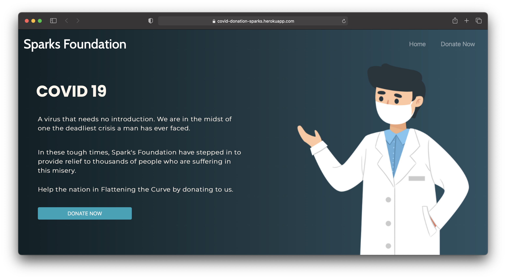

# Donation Website for COVID-19
This repo particularly contains my submission for an Vistual Internship offered by [**Spark's Foundation**](https://www.sparksfoundation.org).

> To view the deployed website, **[Click Here](https://covid-donation-sparks.herokuapp.com)**.

## What's this about ?
**COVID 19**. A Virus that needs no introduction. It's nothing new that this pandemic is one of difficult challenges the mankind as ever faced. 
Due to this people's **lives** and **wealth** are at stake. So, this is my attempt to support the fight against **COVID-19**. 

I made an end-to-end payment integrated website with basic UI through which any person can be a part of this fight by donating.

The payment gateway accepts all payment types like `Credit Card`, `UPI`, `Instant Wallets` and much more..

After you enter all the credentials and process the payment, you will recieve an Automated Confirmation E-mail to the e-mail ID provided before.

> Right now, this is just a prototype website (`test mode`). Which means that it will not deduct any money as of now. 

> By just turning off the **RazorPay's Test Mode**, the website will turn into a full fledged functioning website that will actively accept the donations.

## Questions ?

Post your queries on the [**Discussions**](https://github.com/AdityaNaidu2k2/donation-website/discussions) tab, else contact me : `pokala2002@gmail.com`
